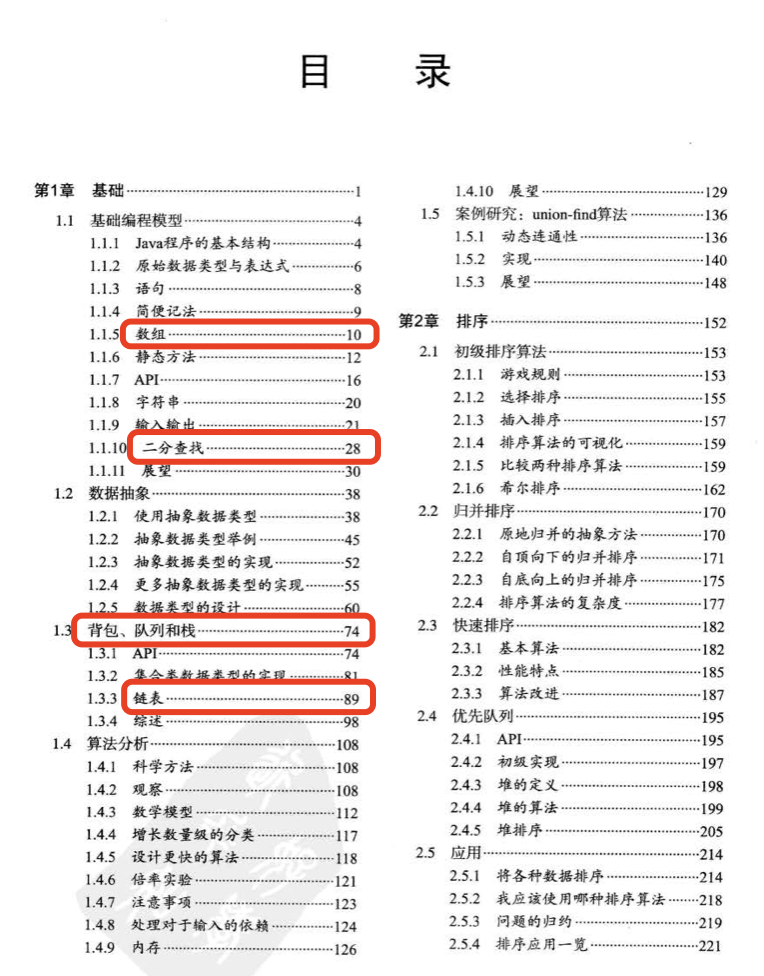

# 介绍 {#guide}

## 本章内容 {#content}

  
  参见《算法 4》目录

第一章主要介绍一些基础的知识，为后续的章节做铺垫。

本次课程从第一章中挑选了一些重点的小节来跟大家分享，同时增加了一部分书中没有详细提到的内容，具体的安排如下：

1. 背包、队列和栈 🌕🌕🌕🌗

   - 数组和集合（Array 和 Map）
   - 背包、队列和栈
     - 基础知识
     - 用 js 实现

2. 二分查找 🌕

   - 初步感受算法的魅力

3. 时间和空间复杂度 🌕🌕🌕🌕🌕

   - 怎么判断算法的优劣
   - 时间和空间复杂度的计算

4. 链表 🌕🌕🌕🌕🌕
   - 线性表
   - 链表
     - 基础概念
     - 基础操作
   - 课后题目
   - leetcode 题目
