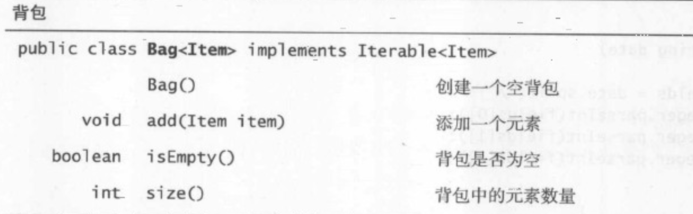
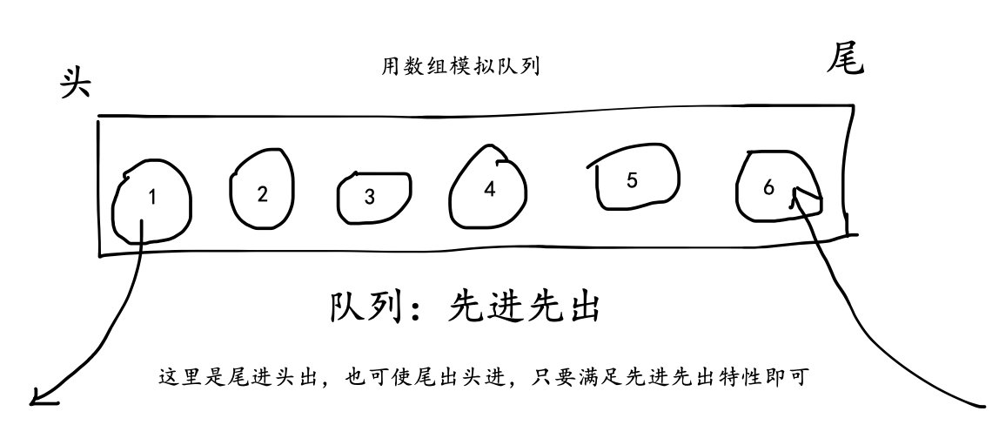
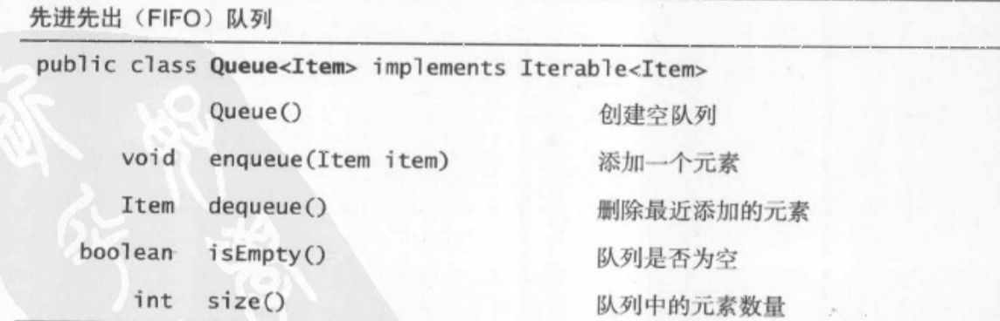
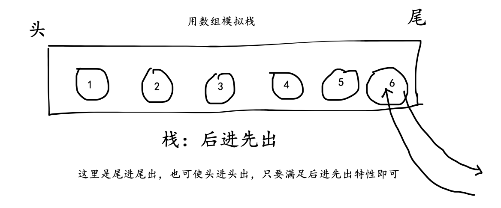
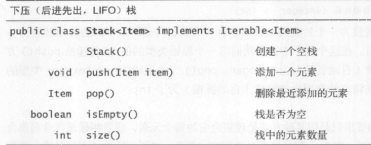

# 背包、队列和栈 {#bag-queue-stack}

三种基础且重要的数据类型：背包(Bag)、队列(Queue)和栈(Stack)。

这三种数据类型都非常的经典，是很多算法的基础。

在其他语言中，比如 java，语言就提供这些基础类型对应的类，可以直接创建，比如 `Stack`, java 中可直接 `new Stack<T>()` 创建，但是 js 并没有内置这些类，但我们可以用 js 中已用的数据类型来实现。

- 用 `Map` 来实现背包
- 用 `Array` 来实现队列和栈

> ES6 引入了 `Map、Set`, 从某种角度上说，它弥补了一些，但并不是真正意义上的 Bag, Queue, Stack，所以还是需要自己来模拟。

:::tip
这里提到的 ”真正意义上的 Bag, Queue, Stack” 以及下文将提到的标准背包、队列和栈主要是参考：《算法 4》书中给出的概念和 API ，以书中给出的背包、队列和栈为标准。
:::

:::tip
书中有泛型的概念，本次教程不涉及此内容，不影响算法的学习。
如果你了解 ts, 那么泛型一定不会陌生。
:::

因此先了解一下 `Set` 集合以及 `Array` 数组，然后再来学习背包、队列和栈。

## 1. 数组和集合 {#array-set}

### 1.1 `Array` 数组

1. 创建并初始化数组

   ```js
   const arr = [1, 2, 3];

   const arr = [];
   arr[0] = 1;
   arr[1] = 2;

   const arr = Array.of(3, 11, 8); // [3, 11, 8]
   const arr = Array(4).fill(7); // [7, 7, 7, 7]
   ```

2. 数组的基本属性和方法

   ```js
   const len = arr.length;

   const arrNew = arr1.concat(arr2);

   const arrNew = arr1.join('xxxx');

   const arrNew = arr1.slice(index, count);

   arr1.splice(index, count, ...args);
   const arr = [1, 2, 3];
   const cut = arr.splice(1, 2, 4, 5);
   console.log(arr, cut); // [1, 4, 5] [2, 3]
   ```

### 1.2 `Map` 集合

```js
//-- 尝试 Map ------------------------------------------------
const m = new Map();

m.set('key1', 'value1');
console.log(m);

m.set('key2', 'value2');
m.forEach((v) => console.log(v));

m.delete('key2');
console.log(m.size);
```

## 2. 背包、队列和栈 {#detail}

### 2.1. 背包 {#bag}

1. 概念

   背包是一种不支持从中删除元素的集合数据类型，它的目的就是收集元素并可迭代遍历所有元素。其中，迭代的顺序与添加的顺序无关。

2. 背包的 API

   书中给出了背包的 API
   <div align='center'>
     
     <span class="comment-alg4-book">参见《算法 4》P74</span>
   </div>

3. 使用 `Map` 模拟标准的背包

   直接利用 `Map` 的 API 实现背包的 `add、isEmpty、size` 和 `forEach` 方法

   ```js
   //-- 使用 Map 模拟背包 ------------------------------------------
   // 利用 Map 的 API 实现 add、isEmpty、size 和 forEach 方法
   class Bag {
     #bag = new Map(); // ES2022 正式为 class 添加了私有属性，方法是在属性名之前使用 # 表示。

     add(item) {
       // 这里为什么要用 Symbol, 第一点：Map 需要唯一的 key(不唯一就覆盖了)；第二点：背包并不需要 key，所以不能让外部感知到 key
       const key = Symbol();
       this.#bag.set(key, item);
     }

     size() {
       return this.#bag.size;
     }

     isEmpty() {
       return !this.#bag.size;
     }

     forEach(cb) {
       typeof cb === 'function' && this.#bag.forEach((v) => cb(v)); // 这里为什么我要再写一个箭头函数呢？原因很简单，因为 map 的 forEach 是支持两个参数的(value, key)，但是背包不需要，所以过滤一下
     }
   }

   const b = new Bag();
   b.add(0);
   b.add(1);
   b.forEach((v) => console.log(v));
   console.log(b.size(), b.isEmpty());
   ```

   :::tip
   因为 `Map` 在添加元素的时候需要 `key` 和 `value`，而且当 `key` 重复时是进行覆盖（更新）的，而我们的背包的目的就是收集元素，因此这里使用了 `Symbol` 作为 `Map` 的 `key`
   :::

   :::tip
   你可能会问，为什么要用 `Map` 来模拟呢？为啥不用 `Set`, `Set` 不需要 `key` 同样也能实现元素收集；还有为啥不用 `Object` 呢？

   - 为什么不用 `Set`：因为 `Set` 会自动去重，这就不满足背包的特性了
   - 为什么不用 `Object`：其实是可以的，只是使用 `Object` 会相对麻烦一些，比如 `forEach` 的实现
     :::

   :::tip
   ES2022 正式为 class 添加了私有属性，方法是在属性名之前使用 # 表示。点击查看详情：
   [提案](https://github.com/tc39/proposal-class-fields), [ES6](https://es6.ruanyifeng.com/#docs/class#%E7%A7%81%E6%9C%89%E6%96%B9%E6%B3%95%E5%92%8C%E7%A7%81%E6%9C%89%E5%B1%9E%E6%80%A7)
   :::

### 2.2. 队列 —— FIFO {#fifo}

1. 概念

   先进先出队列（简称队列）是一种基于先进先出（FIFO）策略的集合类型。在应用程序中使用队列的主要原因是在用集合保存元素的同时**保存他们的相对顺序：使他们入列顺序和出列顺序相同**。

   > 生活中的排队就是典型的例子。任何服务型策略的基本原则就是公平，在提到公平是大多数人的第一个想法就是应该优先服务等待最久的人，这也正是先进先出策略的准则。

    <div align='center'>
     
   </div>

2. 队列的 API
<div align='center'>
  
  <span class="comment-alg4-book">参见《算法 4》P74</span>
</div>

3. 使用数组模拟标准队列

用数组的 API 实现队列的 `enqueue、dequeue、size、isEmpty` 和 `forEach`

```js
//-- 用数组模拟队列 ------------------------------
// 用数组的 API 实现队列的 enqueue、dequeue、size、isEmpty 和 forEach
class Queue {
  #queue = [];

  enqueue(value) {
    // 进入队尾
    this.#queue.push(value);
  }

  dequeue() {
    // 离开队头
    return this.#queue.shift();
  }

  size() {
    return this.#queue.length;
  }

  isEmpty() {
    return !this.#queue.length;
  }

  forEach(cb) {
    typeof cb === 'function' && this.#queue.forEach(cb);
  }
}

const q = new Queue();
q.enqueue(1);
q.enqueue(2);
q.forEach((a) => console.log(a));

const e = q.dequeue();
console.log(q, e);
```

### 2.3. 栈 —— LIFO {#lifo}

1. 概念

   下压栈（简称栈）是一种基于后进先出（LIFO）策略的集合类型。在应用程序中使用栈迭代器的一个典型原因是在用集合保存元素的同时颠倒它们的相对顺序。

   > 生活中也有非常多的例子：比如新邮件会在最前面出现、叠在一起的重物会先拿最上面的、浏览器访问时页面的回退机制。<br>
   > 这种策略的好处就是我们能够及时的获取到最新的消息，但是坏处就是如果不把栈清空，较早的信息就一直不会获取到。

   <div align='center'>
     
   </div>

2. 栈的 API
<div align='center'>
  
  <span class="comment-alg4-book">参见《算法 4》P74</span>
</div>

3. 使用数组模拟标准栈

   用数组的 API 实现栈的 push、pop、size、isEmpty 和 forEach

   ```js
   //-- 用数组模拟栈 ------------------------------
   // 用数组的 API 实现栈的 push、pop、size、isEmpty 和 forEach
   class Stack {
     #stack = [];

     push(value) {
       // 压栈（栈尾）
       this.#stack.push(value);
     }

     pop() {
       // 弹出（栈尾）
       return this.#stack.pop();
     }

     size() {
       return this.#stack.length;
     }

     isEmpty() {
       return !this.#stack.length;
     }

     forEach(cb) {
       typeof cb === 'function' && this.#stack.forEach(cb);
     }
   }

   const s = new Stack();
   s.push(1);
   s.push(2);
   s.forEach((v) => console.log(v));

   console.log(s.pop());
   ```

## 3. 小结 {#summary}

背包、队列和栈是算法中十分基础的数据类型

1. 学习了背包（收集元素）、队列（实现 FIFO）和栈（实现 LIFO）
2. 用 js 实现了以上三者
