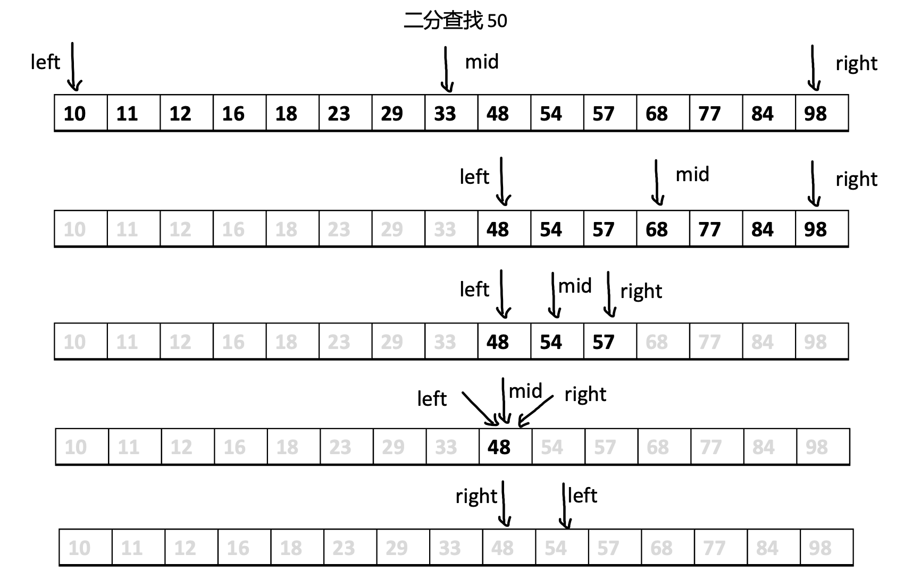

# 算法初体验 —— 二分查找 {#first-experience}

## 1. 引导 {#guide}

思考一个问题，如何在一个**升序排列数组**中找到某个数的下标呢？

比如： `arr = [10, 11, 12, 16, 18, 23, 29, 33, 48, 54, 57, 68, 77, 84, 98]`，如何在这个数组中找到 48 的下标呢？

- 最直接最简单简单的方法：从头到尾遍历这个数组

  :::details 点击查看

  ```js
  const arr = [10, 11, 12, 16, 18, 23, 29, 33, 48, 54, 57, 68, 77, 84, 98];

  function findIndex(num) {
    for (let i = 0; i < arr.length; i++) {
      if (arr[i] === num) {
        return i;
      }
    }
    return -1;
  }

  const i10 = findIndex(10);
  console.log(i10); // 0

  const i48 = findIndex(48);
  console.log(i48); // 8

  const i98 = findIndex(98);
  console.log(i98); // 14
  ```

  循环遍历寻找某个数的下标

  - 最好的情况是仅需要循环 1 次（0）
  - 最坏的情况是需要循环 14 次（98）

  因此，算法时间复杂度为 O(N)，同时只有一个变量存储在内存中，因此算法空间复杂度为 O(1)。
  :::

> 要是你跟我说用什么 `indexOf, findIndex`，我只能说，兄弟，别搞。它们的底层还是基础算法。

## 2. 二分查找 {#binary-search}

### 2.1 算法讲解 {#explanation}

二分查找的详细查找过程，一起来感受一下吧！！

<div align='center'>
  
  <p class="image-title">图1：二分查找 23，仅需查找 3 次</p>
</div>

<div align='center'>
  
  <p class="image-title">图2：二分查找 50， 仅需查找 5 次</p>
</div>

在升序数组中，每次去查找<span class="redBold">查找范围内</span>的中间的元素，这样算法的每次循环都会将查找的范围缩小一半。

- 如果被查找的键等于 `arr[mid]`
- 如果被查找的键大于 `arr[mid]`，那么说明这个键一定在 `arr[mid]` 的右边，这样就将范围缩小一半了
- 同样，如果被查找的键小于 `arr[mid]`，那么说明这个键一定在 `arr[mid]` 的左边

一直循环下去，直到循环终止。

:::tip
循环终止只有两种情况：

1. 查找到了对应的元素
2. 没有查找到，left 指针越过了 right
   :::

### 2.2 代码实现 {#js-code}

1. 迭代版本

   二分查找的迭代版本

   :::details 点击查看

   ```js
   function BinarySearch(arr, key) {
     let left = 0;
     let right = arr.length - 1;
     while (left <= right) {
       const mid = left + ((right - left) >> 1);
       const now = arr[mid];
       if (now > key) {
         right = mid - 1;
       } else if (now < key) {
         left = mid + 1;
       } else {
         return mid;
       }
     }
     return -1;
   }

   function main(arr, key) {
     return BinarySearch(arr, key);
   }

   const arr = [10, 11, 12, 16, 18, 23, 29, 33, 48, 54, 57, 68, 77, 84, 98];

   const res = main(arr, 48);
   console.log(res);
   ```

   :::

2. 递归版本

   二分查找的递归版本

   :::details 点击查看

   ```js
   function BinarySearch(arr, left, right, key) {
     if (left > right) return -1;
     const mid = left + ((right - left) >> 1);
     const now = arr[mid];
     if (now > key) {
       return BinarySearch(arr, left, mid - 1, key);
     } else if (now < key) {
       return BinarySearch(arr, mid + 1, right, key);
     } else {
       return mid;
     }
   }

   function main(arr, key) {
     return BinarySearch(arr, 0, arr.length - 1, key);
   }

   const arr = [10, 11, 12, 16, 18, 23, 29, 33, 48, 54, 57, 68, 77, 84, 98];

   const res = main(arr, 48);
   console.log(res);
   ```

   :::

### 2.3. 小结 {#bs-summary}

在 <span class="redBold">已排序的数组</span> 中查找元素可以直接选择使用二分法：

- 时间复杂度为 O(lgN)
- 算法空间复杂度递归版本 O(lgN), 迭代版本 O(1)

:::tip
升序和降序数组都是一样的
:::

## 3. 小结 {#summary}

实现同样的功能，不同的算法，程序需要执行的次数完全不同，比如升序数组查找元素下标（在最坏的情况下）：

- 普通循环查找需要 N 次
- 二分查找仅需要 lgN 次

:::tip
N 指数组的长度。

lgN 如何计算出来的下一小节会讲。
:::
