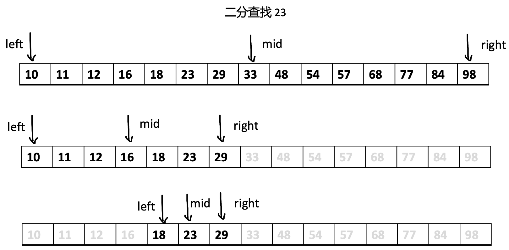

# 时间和空间复杂度 {#complexity}

## 1. 怎么判断一个算法是 ”好“ 算法呢？{#how}

在程序世界中，解决一个问题有多种方式，这些方式最基本的要满足：

1. 能完整地解决问题 —— 准确性
2. 根据这种方式写出的程序在任何情况下都能成功执行 —— 鲁棒性（也称为健壮性）

:::tip
需要注意的是：算法更多的是思想，程序更多的是实现。思想是不变的，实现却有多种（比如不同的语言下不同的实现）
:::

在满足了基本的准确性和鲁棒性的前提下，一个算法的 ”好坏“，**可以从以下两个方面来衡量**：

- 程序的运行时间
- 程序运行所需要的内存空间的大小

在相同的情况下，根据算法思想编写出的程序，运行的时间更短，**运行期间占用的内存更少，那么便可以说，该算法更好**。

但是，我们要如何才能度量程序运行时间呢？难道要拿着秒表计时吗？即便是可以秒表计时，请问不同的计算机下当何如呢？

所以，我们需要一个简单且有效的方式来度量这两个值，**时间复杂度和空间复杂度** 便是这一剂良药。

## 2. 时间复杂度 {#time}

:::warning
注意，时间复杂度的度量有很多种方式，这里仅介绍较流行的方式，以最坏的情况来度量。而在某些实际场景中，还可以用最好的情况和最坏的情况的平均值来作为算法的平均时间复杂度。
:::

时间复杂度并不是指一个程序真正运行的时间，因为这也无法度量，不同的计算机、不同的输入参数都会导致程序运行的时间不同。

时间复杂度是用于近似衡量一个算法运行的时间，这个方法非常有效，通常用 O 来记录（一般读作 Big O）。

> 为什么用 O 来记录，[点击查看详细细节](https://www.geeksforgeeks.org/analysis-of-algorithms-set-3asymptotic-notations/)

那到底怎样度量一个算法的时间复杂度呢？一般是[通过计算循环的迭代次数、比较次数等来测量](https://www.geeksforgeeks.org/what-is-an-algorithm-definition-types-complexity-examples/?ref=lbp)，具体到底何如呢？我们用实际的例子来学习。

### 2.1. O(1) {#t-o-1}

`numSum` 函数调用时，其中的 `a+b` 仅会执行一次，因此时间复杂度是 O(1)

```js
function numSum(a, b) {
  return a + b; // 每次函数调用仅会执行一次
}
```

再看 `complexSum`，看起来比较复杂，但是细细的看，函数在调用时，虽然会执行 5 条语句，但无论输入的参数是什么，每一条语句都仅会执行一次，因此，同样认为这个程序的时间复杂度是 O(1)，它所耗费的时间不依赖于输入。

```js
function complexSum(a, b, c, d) {
  const e = Math.pow(a, 10); // 每次函数调用仅会执行一次
  const f = b - 1; // 每次函数调用仅会执行一次
  const g = c * 4; // 每次函数调用仅会执行一次
  const h = Math.abs(d - 100); // 每次函数调用仅会执行一次
  return e * f + g / h; // 每次函数调用仅会执行一次
}
```

### 2.2. O(N) {#t-o-n}

函数 `sum1ToN` 在每次调用时，因为包含 `for` 循环，其中 `let i = 1; i <= n; i++` 会执行 **n + 1** 次（1,2,3...n-1,n,n+1），`sum += i` 会执行 **n** 次，其它的语句都仅会执行一次。

<span class="redBold">当输入的 n 为无限大时，记作 N，其它语句的执行时间就微不足道了</span>，整个程序耗费的时间完全依赖于 N，所以，我们认为这个程序的时间复杂度为 O(N)，**它所耗费的时间与 N 成正比**。

```js
function sum1ToN(n) {
  let sum = 0; // 每次函数调用时仅会执行一次
  for (let i = 1; i <= n; i++) {
    // 每次函数调用时执行 n + 1 次，1,2,3...n-1,n,n+1
    sum += i; // 每次函数调用时执行 n 次
  }
  return sum; // 每次函数调用时仅会执行一次
}
```

### 2.3. O(N^2) {#t-o-n-2}

1. 初级版本

   函数 `NMMultiply` 在执行时，外层的循环 `for (let i = 1; i < n; i++) ` 会执行 **n** 次，内层的循环 `for (let j = 1; j < m; j++)` 会执行 <span class="redBold">**n \* m** </span> 次。

   :::tip
   这里简单解释一下：

   外层的循环 `for (let i = 1; i < n; i++) ` 每执行一次，内层循环 `for (let j = 1; j < m; j++)` 就会执行 m 次，所以内层循环总共会执行 <span class="redBold">**n \* m** </span> 次，
   :::

   ```js
   function NMMultiply(n, m) {
     let mli = 1; // 每次函数调用仅会执行一次
     for (let i = 1; i < n; i++) {
       // 每次函数调时执行 n 次
       for (let j = 1; j < m; j++) {
         // 每次函数调时执行 n * m 次
         mli += i * j; // 每次函数调时执行 n * m 次
       }
     }
     return mli;
   }
   ```

   <span class="redBold">当输入的 n 和 m 为无限大时，记作 N, M，其它语句的执行时间就微不足道了</span>，而且我们还可以认为 N 和 M 相等，N \* M ≈ N<sup>2</sup>，整个程序执行的时间与 N<sup>2</sup> 成正比，所以，我们认为这个程序的时间复杂度为 O(N<sup>2</sup>)

2. 中级版本

   我们再来看一个非常典型的 时间复杂度为 O(n<sup>2</sup>) 的程序 —— 冒泡排序。

   我们来一步步看函数 `bubbleSort` 执行的过程：

   1. 外层循环 `for (let i = 0; i < n - 1; i++)` 执行第 1 次 `i=0`
   2. 内层循环 `for (let j = i + 1; j < n; j++)` 将执行 n 次
   3. 外层循环 `for (let i = 0; i < n - 1; i++)` 执行第 2 次 `i=1`
   4. 内层循环 `for (let j = i + 1; j < n; j++)` 将执行 n-1 次

   一直循环下去...直到

   1. 外层循环 `for (let i = 0; i < n - 1; i++)` 执行第 n-1 次 `i=n-2`
   2. 内层循环 `for (let j = i + 1; j < n; j++)` 将执行 1 次
   3. 外层循环 `for (let i = 0; i < n - 1; i++)` 执行第 n 次 `i=n-1`，终止

   因此，可计算得出，外层循环总共执行 n 次，内层循环总执行 n + (n-1) + (n-2) + ... + 1，即 (n<sup>2</sup> + n) / 2 次，<span class="redBold">**当输入的 n 为无限大时**</span>，可以认为内层循环需要执行 n<sup>2</sup> 次，因此，我们认为这个程序的时间复杂度为 O(n<sup>2</sup>)

   :::tip
   可以结合注释来看，相信会更加清晰
   :::

   ```js
   // 冒泡排序就是典型的 O(n^2) 的算法
   function bubbleSort(arr) {
     const n = arr.length; // 每次函数调用时仅会执行一次
     for (let i = 0; i < n - 1; i++) {
       // 每次函数调用会执行 n 次，0,1,2,3...n-1
       for (let j = i + 1; j < n; j++) {
         // 每次函数调用会执行 n(n+1)/2 次，即 (n^2 + n) / 2 次，n + (n-1) + (n-2) + ... + 1
         if (arr[i] > arr[j]) {
           // 无法估计，但最多 n(n-1)/2 次，最少 0 次
           const temp = arr[i]; // 无法估计，但最多 n(n-1)/2 次，最少 0 次
           arr[i] = arr[j]; // 无法估计，但最多 n(n-1)/2 次，最少 0 次
           arr[j] = temp; // 无法估计，但最多 n(n-1)/2 次，最少 0 次
         }
       }
     }
   }

   const arr = [12, 2, 6, 4, 11, 1];
   bubbleSort(arr);
   console.log(arr);
   ```

### 2.4. O(lgN) {#t-o-lg-n}

典型的时间复杂度为 O(lgN) 的算法就是二分法。

我们来细细的看：

<div align='center'>
  
  <p class="image-title">二分查找 23</p>
</div>

1. `BinarySearch` 开始第 1 次执行，此时，`left` 到 `right` 的距离为数组的长度 n，然后再次执行到 `BinarySearch`
2. `BinarySearch` 再次被调用，第 2 次执行，此时，`left` 到 `right` 的距离已经为数组长度的一半了 `n/2`
3. `BinarySearch` 再次被调用，第 3 次执行，此时，`left` 到 `right` 的距离已经为数组长度的一半的一半了 `n/4`

一直循环下去...直到

4. `BinarySearch` 再次被调用，第 `lgn` 次执行，此时，`left` 到 `right` 的距离已经为 0

:::tip
我们这里是考虑最坏的情形，即二分到最后（即 left = right）才找到结果或者最终都没有结果（返回 -1）。

其它的情形，比如在中途找到了对应的值，我们暂时先不考虑。
:::

```js
function BinarySearch(arr, left, right, key) {
  if (left > right) return -1;
  const mid = left + ((right - left) >> 1);
  const now = arr[mid];
  if (now > key) {
    return BinarySearch(arr, left, mid - 1, key);
  } else if (now < key) {
    return BinarySearch(arr, mid + 1, right, key);
  } else {
    return mid;
  }
}

function main(arr, key) {
  return BinarySearch(arr, 0, arr.length - 1, key);
}

const arr = [10, 11, 12, 16, 18, 23, 29, 33, 48, 54, 57, 68, 77, 84, 98];

const res = main(arr, 77);
```

函数 `BinarySearch` 中的每一条语句只会执行一次，因此，我们认为 `BinarySearch` 的**时间复杂度本身其实是 O(1)的**，但是，想要最终完成 `main` 函数对于 `key` 的查找，<span class="redBold">`BinarySearch` 在最坏的情形下会执行 `lgn` 次</span>。

<span class="redBold">当输入的 n 为无限大时，记作 N</span>，我们认为这个程序的时间复杂度为 O(lgN)

:::tip
想必你肯定想知道 `BinarySearch` 执行 lgn 次是怎么来的吧！

因：2<sup>x</sup> = n

得：x = log<sub>2</sub><sup>n</sup>

数学世界中 log<sub>10</sub> 可简写为 lg，但在程序的世界中 log<sub>2</sub> 便简写为 lg，因此 log<sub>2</sub><sup>n</sup> 便简写为 lg<sup>n</sup>
:::

### 2.5. O(NlgN) {#t-o-n-lg-n}

典型的时间复杂度为 O(NlgN) 的算法就是归并排序。

后续的章节中会有详细的讲解，这里就不详细的讲述了。

可以简单的先有个认知，什么样的算法时间复杂度会为 O(NlgN) 呢？可以认为外层循环会执行 N 次，每次外层循环执行，内层循环都会执行 lgN 次，这样内层循环总共就会执行 NlgN 次，这样的算法的时间复杂度就会为 O(NlgN)。

### 2.6 小结 {#t-summary}

下表总结了常见的时间复杂度对应的典型代码（《算法 4》称增长数量级）

<div align='center'>
  
  <span class="comment-alg4-book">参见《算法 4》P117</span>
</div>

- 如果程序运行时语句执行次数与输入无关，则认为该程序的时间复杂度就为 O(1)
- 如果程序运行时某一条或多条语句执行次数与输入 N 成线性关系，则认为该程序的时间复杂度就为 O(N)
- 如果程序运行时某一条或多条语句执行次数与输入 N<sup>2</sup> 成线性关系，则认为该程序的时间复杂度就为 O(N<sup>2</sup>)

## 3. 空间复杂度 {#space}

空间复杂度和时间复杂度非常的类似，同样使用 O 来记录（Big O）

一个程序在运行过程中所占用的存储空间主要有三个部分：

- 程序代码本身所占用的存储空间
- 程序的输入输出数据所占用的存储空间
- 程序在运行过程中所需要的临时存储空间

对于第一部分：不同的算法思想下所写的程序代码各有不同，为了减少代码的存储空间，那么就需要尽量的减少所写的代码。**但这并不是绝对的，有时候多写一句代码会让语义更加清晰，没有必要非得为了少写一句代码而降低程序的可读可理解性。**

对于第二部分：程序的输入和输出往往是由程序需要解决的问题而决定的，因此，不论使用哪一种算法，这都不会有太大的差别。

对于第三部分：实际上，即便使用不同的算法，前两部分对于程序的空间复杂度的影响并不大，真正有较大影响是程序运行过程中所需要的临时空间，不同的算法，在运行时所需的临时空间通常会有较大的不同。

下面我们来看几个实例的例子

### 3.1. O(1) {#s-o-1}

函数 `numSum` 在运行时需要 3 个临时的变量空间，函数 `complexSum` 在运行时需要 9 个临时的变量空间，**均与输入无关**，无论输入值是什么，程序在运行中所需要的空间都是固定的，因此，我们认为这个程序的空间复杂度为 O(1)

```js
function numSum(a, b) {
  // a, b 需要 2 个临时的变量空间
  return a + b; // 需要 1 个临时的变量空间
}

function complexSum(a, b, c, d) {
  // a, b, c, d 需要 4 个临时的变量空间
  const e = Math.pow(a, 10); // e 需要 1 个临时的变量空间
  const f = b - 1; // f 需要 1 个临时的变量空间
  const g = c * 4; // g 需要 1 个临时的变量空间
  const h = Math.abs(d - 100); // h 需要 1 个临时的变量空间
  return e * f + g / h; // 需要 1 个临时的变量空间
}
```

### 3.2. O(N) {#s-o-n}

函数 `numToArr` 在运行时所需要占用的空间如下：

- 输入 n 需要 1 个临时的变量空间
- 数组 arr 需要 1 个临时的变量空间
- 循环 i 需要 1 个临时的变量空间
- `arr[i] = i` 每执行一次，就会增加一个元素，相应的就需要多占用一个临时空间，总共会执行 n 次，因此会需要 n 个临时空间
- 输出需要 1 个空间

总计需要 n+4 个空间，<span class="redBold">当输入的 n 为无限大时，记作 N</span>，程序的运行时所需要的空间依赖输入 N，与 N 成正比，因此，我们认为这个程序的空间复杂度为 O(N)

```js
function numToArr(n) {
  // n 需要 1 个临时的变量空间
  const arr = []; // arr 需要 1 个临时的变量空间
  for (let i = 0; i < n; i++) {
    // i 需要 1 个临时的变量空间
    // 每执行一次，就会增加一个元素，相应的就需要多占用一个临时空间
    // 总共会执行 n 次，因此会需要 n 个临时空间
    arr[i] = i;
  }
  return arr; // 需要 1 个临时的变量空间
}

const numArr = numToArr(100);
console.log(numArr);
```

### 3.3 小结 {#s-summary}

总结如下：

- 如果程序运行时所占用的存储空间与输入无关，则认为该程序的空间复杂度就为 O(1)
- 如果程序运行时所占用的存储空间与输入 N 成线性关系，则认为该程序的空间复杂度就为 O(N)
- 如果程序运行时所占用的存储空间与输入 N<sup>2</sup> 成线性关系，则认为该程序的空间复杂度就为 O(N<sup>2</sup>)

> 其它类型按照上述的总结一致

## 4. 总结 {#complexity-summary}

判断一个算法的优劣主要就是从时间和空间复杂度上去衡量。

由于现在设备的内存空间越来越大，所以在大多数场景中，我们往往更注重的是时间复杂度，而空间复杂度只要在一个合理的范围内即可。但这也并非绝对，虽然现在设备的空间确实够大，但在某些对于空间要求极致的场景中，空间复杂度还是很重要的。

:::tip
如果你刷过 leetcode，那你肯定知道，leetcode 上的题目既会限制时间又会要求空间的
:::
