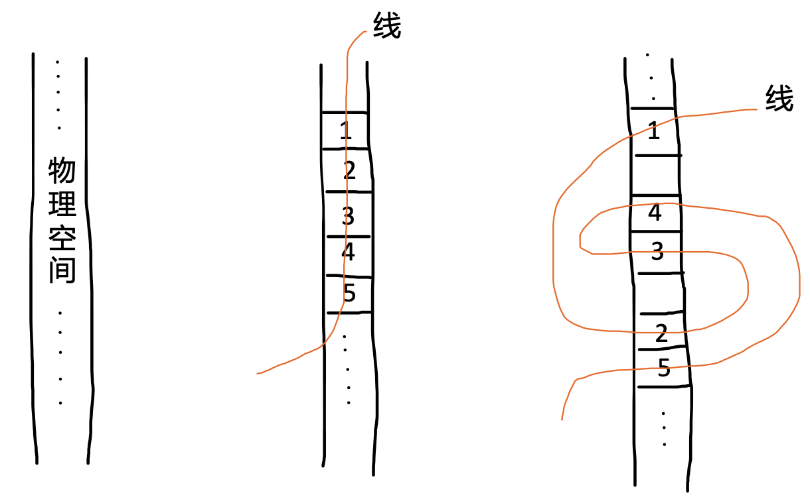
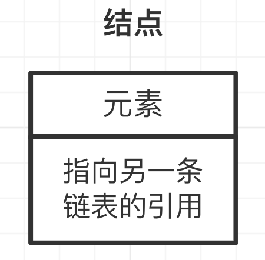
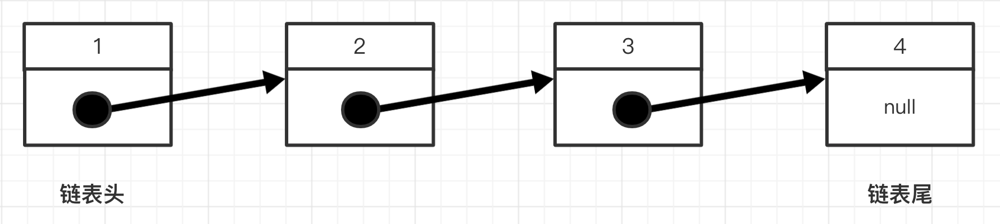
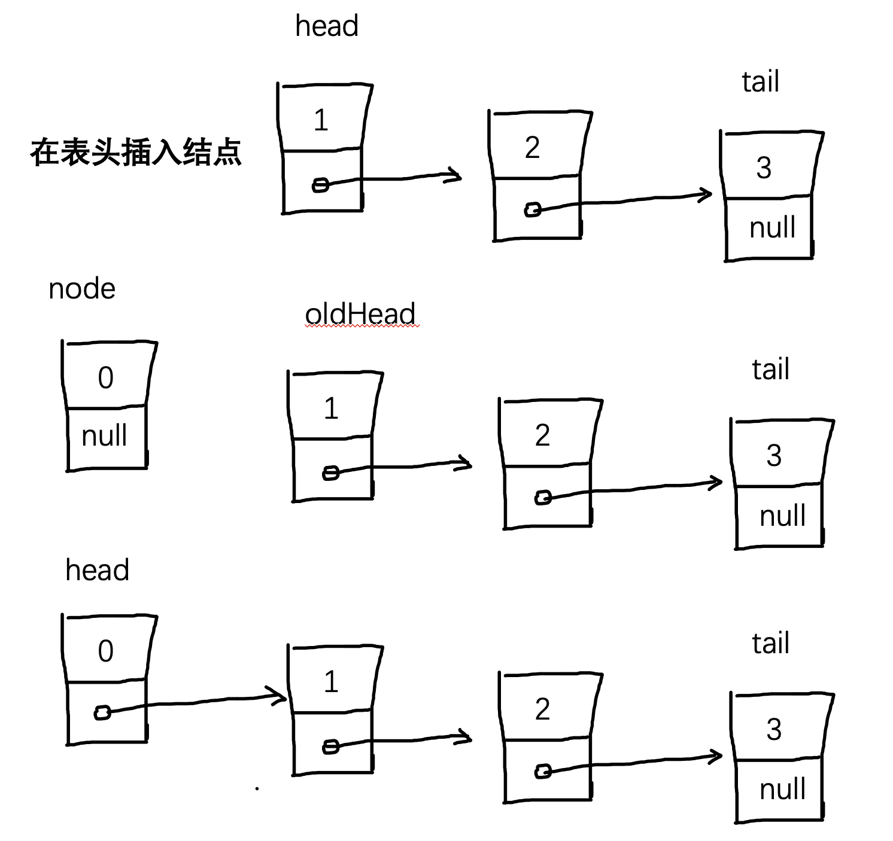
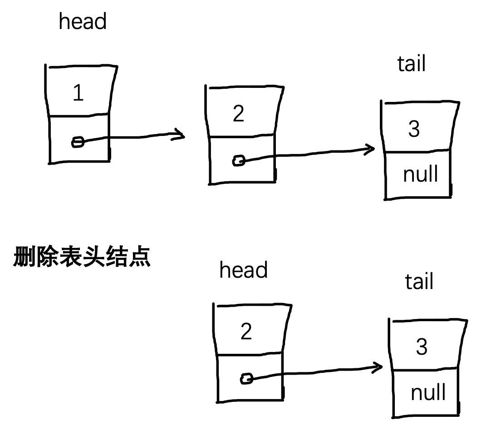
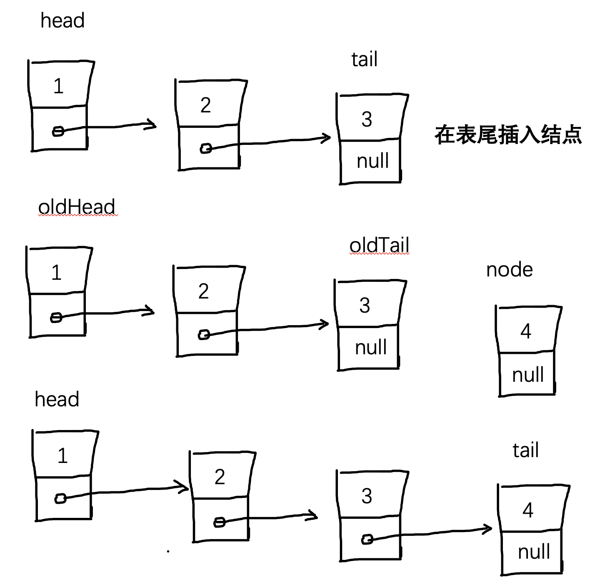

# 链表 {#link}

链表是的线性表的一个类别，在学习链表之前，让我们先来看看线性表。

:::tip
《算法 4》 中并没有涉及到线性表，但是这属于数据结构中非常基础的部分，对于学习链表也非常有价值，因此在这里提出，如果你了解的话，可以直接跳到第 2 小节。
:::

## 1. 线性表 {#linear-list}

### 1.1 线性表 {#linear-l}

线性表是一组线性存储结构的数据，什么是线性存储结构呢？通俗的理解就是：一组数据存储在物理空间中，可以用“一根线”线性地把它串起来。

比如有这样一组数组：1，2，3，4，5，将其线性的存储起来，有两种方式：

<div align='center'>
  
  <p class="image-title">图1：两种存储线性表的方式</p>
</div>

这两种方式都是线性存储的，但第一种是按照物理空间依次存储的，第二种是随机存储的。

第一种是多数人想到的存储方式，而第二种却少有人想到。那么数据是否成功地存储了呢？这取决于能否将数据完整地复原成它本来的样子。如果把两种方式的线的一头扯起，就会发现数据的位置次序是没有发生改变的。因此可以认定，这两种存储方式都是正确的。

:::tip
线性表的定义和特点的详细说明可以参见：《数据结构（C 语言版本）（第二版）》2.1 线性表的定义和特点
:::

### 1.2 线性表的顺序存储（顺序表）{#sequential-list}

线性表的顺序存储指的是用一组**地址连续的存储单元依次存储线性表的数据元素**，这种表示也称作线性表的顺序存储结构或顺序映像。通常，称这种存储结构的线性表为顺序表（Sequential List）。**其特点是，逻辑上相邻的数据元素，其物理次序也是相邻的**。

在高级程序设计语言中，通常都用数组来描述数据结构中的顺序存储结构。

1.1 中图 1 的第一种存储方式就是顺序存储结构 —— 顺序表

### 1.3 线性表的链式存储（链表）{#link-list}

线性表的链式存储的特点是：**用一组任意的存储单元存储线性表的数据元素（这组存储单元可以是连续的，也可以是不连续的）**。

因此，为了表示每个数据元素 a<sub>i</sub> 与其直接后继数据元素 a<sub>i+1</sub> 之间的逻辑关系，对数据元素 a<sub>i</sub> 来说，除了存储其本身的信息之外，还需存储一个指示其直接后继的信息（即直接后继的存储位置）。这两部分信息组成数据元素 a<sub>i</sub> 的存储映像，称为结点（node）。

一个结点包括两个域：

- 数据域：存储数据元素信息的域
- 指针域：存储直接后继存储位置的域。指针域中存储的信息称作指针或链。

n 个结点（a<sub>i</sub>（1≤i≤n）的存储映像）链结成一个链表，即为线性表(a<sub>1</sub>, a<sub>2</sub>,…, a<sub>n</sub>)的链式存储结构。又由于此链表的每个结点中只包含一个指针域，故又称线性链表或单链表。

1.1 中图 1 的第二种方式就是链式存储结构 —— 链表

### 1.4 小结 {#linear-list-s}

- 线性表是一种线性存储结构
- 线性表顺序存储就是顺序表
- 线性表链式存储就是链表（可以顺序存储，也可不顺序存储，可连续存储，也可不连续存储）

## 2. 链表 {#link-all}

### 2.1. 基本定义 {#link-desc}

定义：链表是一种递归的数据结构，它或者为空（null），或者指向一个结点（node）的引用，**该结点含有一个泛型的<span style="color:red">元素</span>和一个<span style="color:red">指向另一条链表的引用</span>**。

> 泛型：任意类型数据

<div align='center'>
  
  <p class="image-title">图1：链表结点</p>
</div>

<div align='center'>
  
  <p class="image-title">图2：链表</p>
</div>

### 2.2. 链表分类 {#link-classification}

根据链表结点所含指针个数、指针指向和指针连接方式，可将链表分为单链表、循环链表、双向链表、二叉链表、十字链表、邻接表、邻接多重表等。

其中单链表、循环链表和双向链表用于实现线性表的链式存储结构，其他形式多用于实现树和图等非线性结构。

最常见的就是单链表，我们也主要对单链表进行学习。

### 2.3. 链表基础操作 {#link-basic-action}

1. 用 js 表示一个结点

   按照结点的定义：

   - 含有一个泛型的元素（这里的泛型可以简单的理解为任何类型）
   - 指向另一条链表的引用（也就是说，有一个指向另一个结点的值）

   ```js
   class Node {
     constructor(value = null, next = null) {
       this.value = value; // 元素
       this.next = next; // 指向另一条链表，另一个结点的值
     }
   }
   ```

   :::tip
   其实定义结点用 ts 更加合适，因为结点的指针指向的要么是一个结点，要么是 null，所以用 ts 更好地实现这样的嵌套类，实现类型的检查。

   ```ts
   class LinkNode {
     value: any;
     next: LinkNode | null;

     constructor(value: any = null, next: LinkNode | null = null) {
       this.value = value;
       this.next = next;
     }
   }
   ```

   :::

2. 创建一条链表

   创建一条链表非常的简单，只需要将所有的结点连接起来，就形成了一条链表

   - 用定义好的 Node 类创建结点
   - 将结点按照期望的顺序连接起来（怎么连接？前一个结点的 next 指向后一个结点即可）

   此时：

   - first 就是一条拥有三个结点的链表，first 是一个结点的引用，该结点含有一个指向 second 的引用
   - second 同样是一个拥有两个结点的链表，second 同样是一个结点的引用，该结点含有一个指向 first 的引用
   - third 同样是一个拥有一个结点的链表，third 也是一个结点的引用，该节点指向 null，即空链表

   ```js
   let first = new Node('1');
   const second = new Node('2');
   const third = new Node('3');

   first.next = second;
   second.next = third;

   console.log(JSON.stringify(first, null, 2));
   // {
   //   "value": "1",
   //   "next": {
   //     "value": "2",
   //     "next": {
   //       "value": "3",
   //       "next": null
   //     }
   //   }
   // }
   ```

3. 在表头插入结点

   非常的简单，总结一句话：**新结点的指针指向链表表头即完成在表头插入结点**

  <div align='center'>
    
    <p class="image-title">图1：在链表头部插入结点</p>
  </div>

```js
function insertNodeAtHead(link, node) {
  node.next = link;
  return node;
}

const insert = new Node('0', null);
first = insertNodeAtHead(first, insert);
console.log(JSON.stringify(first, null, 2));

// {
//   "value": "0",
//   "next": {
//     "value": "1",
//     "next": {
//       "value": "2",
//       "next": {
//         "value": "3",
//         "next": null
//       }
//     }
//   }
// }
```

4. 删除表头结点

   非常的简单，同样总结一句话：**表头结点修改为表头的下一个结点即完成表头结点的删除**
   :::tip
   删除后，旧的头结点其实并没有直接删除，而是等到内存回收机制来对它进行处理，如果这个结点没有任何地方引用，那么就会清除掉，否者仍然保留
   :::
    <div align='center'>
      
      <p class="image-title">图2：删除链表首结点</p>
    </div>

   ```js
   function deleteNodeAtHead(link) {
     link.value = null;
     return link.next;
   }

   first = deleteNodeAtHead(first);
   console.log(JSON.stringify(first, null, 2));

   // {
   //   "value": "2",
   //   "next": {
   //     "value": "3",
   //     "next": null
   //   }
   // }
   ```

5. 在表尾插入结点

   非常的简单，同样总结一句话：**从表头开始，循环找到尾结点，尾结点的指针指向新结点即完成表尾插入新结点**。

    <div align='center'>
      
      <p class="image-title">图3：链表结尾插入新结点</p>
    </div>

   关键点就在于：**如何找到尾结点**。其实非常的简单，一个链表中什么样的结点是尾结点呢？有什么样的特征呢？那就是<span class="redBold">链表结点的指针域指向 null 的结点便是尾结点</span>。所以，只需要从表头开始，一步一步地往下循环查找，一直查找到某个结点的指针指向 null 停止。

   ```js
   function insertNodeInTail(link, node) {
     let p = link;
     while (p.next !== null) {
       p = p.next;
     }
     p.next = node;
   }

   const insert = new Node('4');
   insertNodeInTail(first, insert);
   console.log(JSON.stringify(first, null, 2));

   // {
   //   "value": "1",
   //   "next": {
   //     "value": "2",
   //     "next": {
   //       "value": "3",
   //       "next": {
   //         "value": "4",
   //         "next": null
   //       }
   //     }
   //   }
   // }
   ```

6. 删除指定结点

   **参照前面的链表基础操作，作为思考题。**

   具体的讲解放在了第 3 小节课后习题中。

7. 在指定结点前插入新结点

   **参照前面的链表基础操作，作为思考题。**

   具体的讲解放在了第 3 小节课后习题中。

### 2.4 用链表实现栈和队列 {#link-stack-queue}

前面我们用数组（顺序表）实现了栈和队列，这里我们用链表同样可以实现。

> 用链表实现栈相比较队列要简单一些，因此先实现栈

1. 用链表实现栈

   实现 LIFO 的 API。

   ```js
   class Node {
     constructor(value = null, next = null) {
       this.value = value;
       this.next = next;
     }
   }

   // LIFO
   class StackByLink {
     link = null; // 其实这里也同样应该设置为私有属性的，但为了展示，这里就仍然使用普通属性
     #size = 0; // ES2022 正式为 class 添加了私有属性，方法是在属性名之前使用 # 表示。

     push(value) {
       this.#size += 1;
       this.link = new Node(value, this.link);
     }

     pop() {
       if (this.#size !== 0) {
         this.#size -= 1;
         const value = this.link.value;
         this.link = this.link.next;
         return value;
       }
       return null;
     }

     size() {
       return this.#size;
     }

     isEmpty() {
       return !this.#size;
     }

     forEach(cb) {
       if (typeof cb === 'function') {
         let p = this.link;
         while (p !== null) {
           cb(p.value);
           p = p.next;
         }
       }
     }
   }

   const s = new StackByLink();
   s.push(1);
   s.push(2);
   s.push(3);

   console.log('s', s);
   s.forEach((value) => console.log(value));

   const sp = s.pop();
   console.log('sp', sp);
   console.log('s', s);
   ```

2. 用链表实现队列

   同样实现 FIFO 的 API。

   ```js
   class QueueByLink {
     link = null;
     #last = null;
     #size = 0;

     enqueue(value) {
       // 链尾添加
       if (this.#size === 0) {
         this.#last = new Node(value, null);
         this.link = this.#last;
       } else {
         const oldLast = this.#last;
         this.#last = new Node(value, null);
         oldLast.next = this.#last;
       }
       this.#size += 1;
     }

     dequeuq() {
       // 链头删除
       if (this.#size !== 0) {
         this.#size -= 1;
         const value = this.link.value;
         this.link = this.link.next;
         return value;
       }
       return null;
     }

     size() {
       return this.#size;
     }

     isEmpty() {
       return !this.#size;
     }

     forEach(cb) {
       if (typeof cb === 'function') {
         let p = this.link;
         while (p !== null) {
           cb(p.value);
           p = p.next;
         }
       }
     }
   }
   ```

### 2.5. 小结 {#link-summary}

数组：顺序存储，数组中是元素

链表：链式存储，链表中是结点

## 3. 课后习题 {#after-class-exercises}

1. 假设 x 是一条链表的某个结点且不是尾结点。下面这条语句的效果是什么？

   ```js
   x.next = x.next.next;
   ```

   :::details 点击查看参考答案
   删除 x.next 结点
   :::

2. 编写一个方法 delete()，接收一个参数 k，删除链表的第 k 个元素，如果它存在的话

   :::details 点击查看参考答案

   ```js
   function deleteKNode(link, k) {
     if (link === null) throw Error('link is null');
     if (k <= 0) throw Error('k should ght 0');
     if (k === 1) return link.next;
     let curr = link;
     // 找到第 k-1 个结点，因此循环 k-2 次
     for (let i = 0; i < k - 2; i++) {
       curr = curr.next;
       if (curr.next === null) return link;
     }
     curr.next = curr.next.next;
     return link;
   }

   console.log(JSON.stringify(deleteKNode(first, 11), null, 2));
   ```

   :::

3. 假设 x 是一条链表中的某个结点，下面这段代码做了什么？

   ```js
   t.next = x.next;
   x.next = t;
   ```

   :::info
   t 也是一个结点哈
   :::

   :::details 点击查看参考答案
   在 x 结点后添加 t 结点
   :::

4. 下面这段代码又做了什么呢？

   ```js
   x.next = t;
   t.next = x.next;
   ```

   :::details 点击查看参考答案
   x 结点指向了 t 结点，t 结点指向了自己。
   :::

5. 编写一个函数，接受一条链表的首结点作为参数，（破坏性地）将链表反转并返回结果链表的首结点
   :::details 点击查看参考答案

   ```js
   function reverse_v2(link) {
     let p = link;
     let reverse = null;

     while (p !== null) {
       const node = p;
       p = p.next;
       node.next = reverse;
       reverse = node;
     }

     return reverse;
   }
   ```

   :::

## 4. leetcode 题目 {#leetcode}

1. 给你单链表的头指针 head 和两个整数 left 和 right，其中 left <= right 。请你反转从位置 left 到位置 right 的链表结点，返回反转后的链表。[点击查看 LeetCode 题目](https://leetcode.cn/problems/reverse-linked-list-ii/)

   - 解法 1
     :::details 点击查看参考答案

     ```js
     class Node {
       constructor(value = null, next = null) {
         this.value = value;
         this.next = next;
       }
     }

     const reverseLink = function (head) {
       let curr = null;
       let prev = head;
       while (prev) {
         const next = prev.next;
         prev.next = curr;
         curr = prev;
         prev = next;
       }
       return curr;
     };

     function reverseBetweenNM(head, left, right) {
       const dummyNode = new Node(-1, head); // 虚拟头结点
       let preLeft = dummyNode; // 左截断结点前一个结点
       let leftNode = null; // 左截断结点
       let rightNode = null; // 右截断结点
       let afterRight = null; // 右截断结点后一个结点
       // 1. 获取左截断结点前一个结点
       for (let i = 0; i < left - 1; i++) {
         preLeft = preLeft.next;
       }
       // 2. 获取左截断结点
       leftNode = preLeft.next;

       rightNode = leftNode;
       // 3. 获取右截断结点
       for (let i = 0; i < right - left; i++) {
         rightNode = rightNode.next;
       }
       // 4. 获取右截断结点后一个结点
       afterRight = rightNode.next;
       // 5. 反转截断的链表
       rightNode.next = null;
       reverseLink(leftNode);
       // 6. 左截断结点前一个结点连接上反转后的链表
       preLeft.next = rightNode;
       // 7. 反转后的链表尾结点为左截断结点，结点连接右截断结点后一个结点
       leftNode.next = afterRight;
       // 8. 返回链表
       return dummyNode.next;
     }
     ```

     :::

   - 解法 2
     :::details 点击查看参考答案

     ```js
     function reverseBetweenNMBetter(head, left, right) {
       const dummyNode = new Node(-1, head); // 虚拟头结点
       let preLeft = dummyNode; // 左截断结点前一个结点

       for (let i = 0; i < left - 1; i++) {
         preLeft = preLeft.next;
       }

       let leftNode = preLeft.next;
       let rightNode = leftNode;
       let curr = null;
       for (let i = 0; i < right - left + 1; i++) {
         const node = rightNode;
         rightNode = rightNode.next;
         node.next = curr;
         curr = node;
       }

       preLeft.next = curr;
       leftNode.next = rightNode;

       return dummyNode.next;
     }
     ```

     :::

   - 解法 3

     :::details 点击查看参考答案

     ```js
     function reverseBetweenNMPerfect(head, left, right) {
       const dummyNode = new Node(-1, head); // 虚拟头结点
       let preLeft = dummyNode; // 左截断结点前一个结点

       for (let i = 0; i < left - 1; i++) {
         preLeft = preLeft.next;
       }

       let curr = preLeft.next;
       let leftNode = curr;
       for (let i = 0; i < right - left; i++) {
         const next = curr.next;
         curr.next = next.next;
         next.next = leftNode;
         leftNode = next;
       }

       preLeft.next = leftNode;

       return dummyNode.next;
     }
     ```

     :::

2. 给你两个单链表的头结点 headA 和 headB ，两条链表可能相交也可能不相交，如果相交请你找出并返回两个单链表相交的起始结点，如果不存在相交结点，返回 null。[点击查看 LeetCode 题目](https://leetcode.cn/problems/intersection-of-two-linked-lists/)

   :::tip
   这道题目是算法里我最喜欢的了，没有之一，至于为什么，看下面的题解 2 就知道了
   :::

   - 解法 1
     :::details 点击查看参考答案

     ```js
     const getIntersectionNode_v1 = function (headA, headB) {
       let temp = headA;
       const visited = new Set();
       while (temp !== null) {
         visited.add(temp);
         temp = temp.next;
       }

       temp = headB;
       while (temp !== null) {
         if (visited.has(temp)) {
           return temp;
         }
         temp = temp.next;
       }
       return null;
     };
     ```

     :::

   - 解法 2

     解题之前让我们来看一个视频，[点击查看](https://www.zhihu.com/zvideo/1235273627240955904)

     这种巧妙的方式是：分别为链表 A 和链表 B 设置指针 A 和指针 B，然后开始遍历链表，如果遍历完当前链表，则将指针指向另外一个链表的头部继续遍历，直至两个指针相遇。

     最终两个指针分别走过的路径为：

     - 指针 A :a+c+b
     - 指针 B :b+c+a

     明显 a+c+b = b+c+a,因而如果两个链表相交，则指针 A 和指针 B 必定在相交结点相遇。

     解法来自： [教你用浪漫的方式找到两个单链表相交的起始节点](https://leetcode.cn/circle/article/KquFwH/)

     **所以如果你够浪漫，算法题都能刷出爱情的味道。**
     :::details 点击查看参考答案

     ```js
     const getIntersectionNode_v2 = function (headA, headB) {
       if (headA === null || headB === null) return null;
       let pA = headA,
         pB = headB;
       while (pA !== pB) {
         pA = pA === null ? headB : pA.next;
         pB = pB === null ? headA : pB.next;
       }
       return pA;
     };
     ```

     :::
