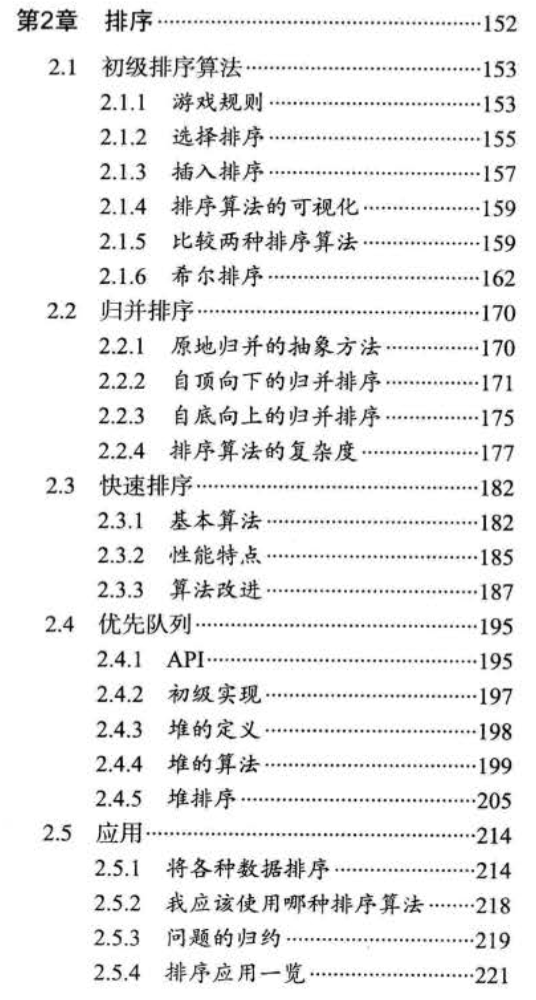

# 第二章 排序 {#guide}

## 本章内容 {#content}

  
  参见《算法 4》目录

第二章主要介绍排序，相当相当的重点

- 不管是实际生活还是程序，只要涉及到逻辑处理，排序绝对是必须的
- 几乎所有语言都会内置排序，一般优异的语言内置的排序都会按照使用情形来选择底层算法
- 算法基础面试必问

:::tip
在本章里将的所有排序，都是对数组进行排序
:::

本章的每一部分都非常重要，因此具体安排如下

1. 基础排序 🌕🌕🌗

- 选择排序（冒泡排序）
- 插入排序
- 算法比较（主要是时间复杂度）

2. 归并排序 🌕🌕🌕🌕🌕

- 迭代版本
- 递归版本

3. 快速排序 🌕🌕🌕🌕🌕

- 算法知识

4. 堆排序（待考虑）🌕🌕🌕🌗

- 算法知识

5. 算法的比较和分析

- 不同情形下使用不同的底层算法

6. leetcode 题目 🌕🌕🌕🌕🌕
