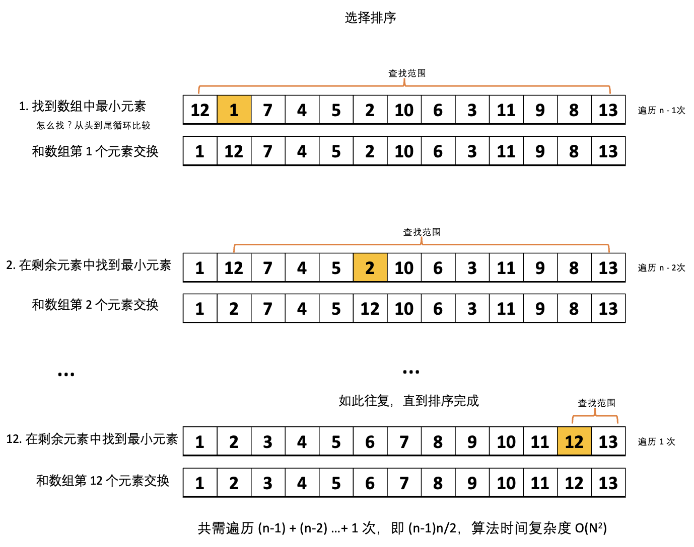
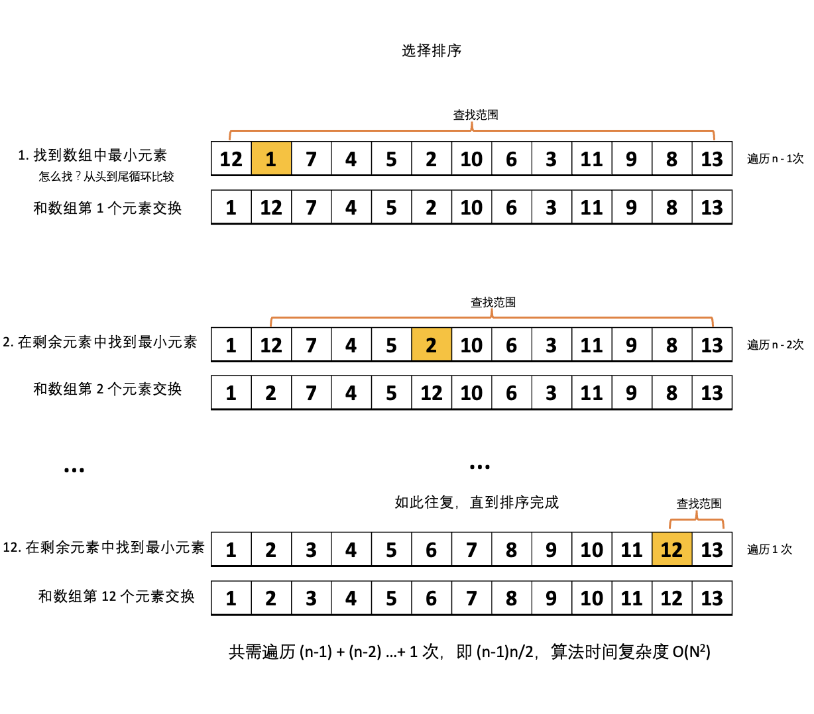

# 基础排序 {#basic_sort}

先来讲讲基础的排序算法。虽然都是基础的算法，但理解其中思路还是非常有必要的。

:::tip
在本章里将的所有排序，都是对数组进行排序
:::

## 1. 选择排序 {#select-sort}

选择排序实现步骤：

- 找到数组中最小的那个元素
- 将它和数组的第 1 个元素交换位置（如果第 1 个元素就是最小元素，那么就和自己交换）
- 在剩下的元素中找到最小的那个元素
- 将它与数组的第 2 个元素交换位置
- ......

如此往复，直到将整个数组排序。

因为算法是在不断地选择剩余元素之中的最小者，所以算法称为选择排序。还有另一个叫法，冒泡排序，因为每次都是将剩余元素之中的最小者 ”冒泡“ 似的排在了前面。

<div align='center'>
  
  <p class="image-title">图1：选择排序</p>
</div>

:::tip
实现数组元素交换

```js
function swap(arr, i, j) {
  const temp = arr[i];
  arr[i] = arr[j];
  arr[j] = temp;
}
```

::::

```js
function swap(arr, i, j) {
  const temp = arr[i];
  arr[i] = arr[j];
  arr[j] = temp;
}

// 选择排序
function SelectionSort(arr) {
  const l = arr.length;
  for (let i = 0; i < l; i++) {
    let min = i;
    for (let j = i + 1; j < l; j++) {
      // 查找剩余元素中最小的那一个所在的位置
      if (arr[j] < arr[min]) min = j;
    }
    // 将剩余元素中最小元素和当前位置元素进行交换
    swap(arr, i, min);
  }
}
```

算法时间复杂度为：在最差情形下共需遍历 (n-1) + (n-2) …+ 1 次，即 (n-1)n/2，算法时间复杂度 O(N2)

## 2. 插入排序 {#insert-sort}

不知道大家在整理扑克的时候是怎样的，想来通常都是一张一张的，将每一张牌插入到其它已经有序的牌中的适当位置，直到将所有牌整理完成。

- 将第 2 个元素正确地插入到前面已排序的元素中（此时就只有 1 个元素）

  > **这里的关键在于如何正确的插入，也很简单，就是从后往前依次与前一个元素进行比较**

  - 如果元素小于前一个元素，交换，然后再进行下一轮比较
  - 如果大于或等于，那么就是正确位置了

- 将第 3 个元素正确地插入到前面已排序的元素中（此时就有了 2 个元素）
- ......

如此往复，直到将整个数组排序。

按照这样的思路进行排序，每一次都是将元素插入到已经有序的元素组中，因为，这种排序算法称为插入排序。

<div align='center'>
  
  <p class="image-title">图2：插入排序</p>
</div>

```js
function swap(arr, i, j) {
  const temp = arr[i];
  arr[i] = arr[j];
  arr[j] = temp;
}

// 插入排序
function InsertSort(arr) {
  const l = arr.length;
  for (let i = 1; i < l; i++) {
    for (let j = i; j > 0; j--) {
      // 元素与前一个元素进行比较，小于就交换
      if (arr[j] < arr[j - 1]) swap(arr, j, j - 1);
      // 否者就是找到了正确的位置，退出循环
      else break;
    }
  }
}
```

## 3. 比较两种排序算法

现在已经实现了两种排序算法，那么到底那种排序算法更快呢？

结论：对于随机排序的无重复主键的数组，插入排序和选择排序的运行时间都是平方级别的，两者之比应该是一个较小的常数。

## 4. 小结 {#summary}

基础排序还有一种，就是希尔排序，主要思想是使得数组中任意间隔为 `h` 的元素都是有序的。

虽然这两种算法的时间复杂度都是 O(N<sup>2</sup>)，但是作为排序算法的基础，我们还是很有必要学一学的。
