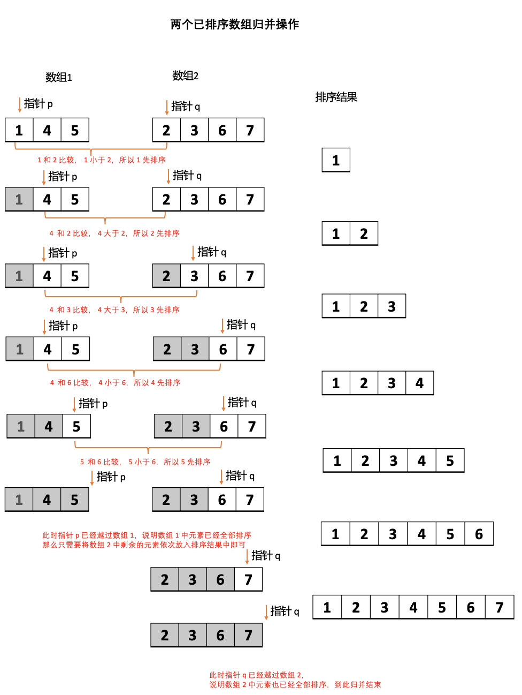
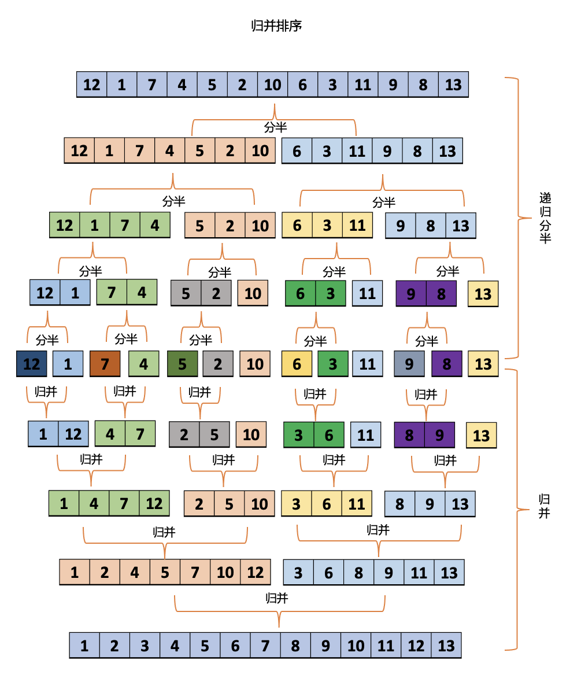

# 归并排序 {#merge-sort}

归并排序能够保证将把任意长度为 N 的数组排序所需时间和 NlogN 成正比。

## 1. 归并操作 {#merge}

归并操作，就是将两个有序的数组归并成一个更大的有序数组。归并排序就是在这个基础上发明。

假设有以下两个已排序的数组（升序），请问如何将这两个数组有序地合并在一起（合并后仍然保持升序）。

- 数组 1：`[1, 4, 5]`
- 数组 2：`[2, 3, 6, 7]`

<div align='center'>
  
  <p class="image-title">图1：两个已排序数组归并操作</p>
</div>

整个的归并过程

- 步骤 1：定义两个指针 `p 和 q` 分别指向两个数组的起始位置 0，定义一个数组用于存储排序结果
- 步骤 2：比较 `p 和 q` 位置对应的元素大小
  - 如果 `arr1[p] > arr2[q]`，那么将 `q` 位置对应元素放入结果中，并且 `q` 往右移动 1 位（即 `q++`）
  - 否者，将 `p` 位置对应元素放入结果中，并且 `p` 往右移动 1 位（即 `p++`）
- 重复步骤 2，直到其中一个数组中的元素被全部排序成功

  > 在代码中就指针 `p 或 q` 越过各自数组，即 `p > arr1.length - 1 或 q > arr2.length - 1`

- 步骤 3：将另一个未完全排序数组中的剩余元素依次挪到排序结果中
  > 因为数组本身就是已排序的，所以可直接挪动

### 1.1 两个已排序数组的归并 {#merge-tow-sorted-arr}

```js
// 归并两个已排序的数组
function merge_tow_sorted_arr(arr1, arr2) {
  const l1 = arr1.length;
  const l2 = arr2.length;
  const res = [];

  // 指针 p 指向数组 1，指针 q 指向数组 2，指针 k 指向数组 res，
  // 当 p 和 q 都越过了数组，意味着两个数组中的元素都排序完了，此时退出
  for (let p = 0, q = 0, k = 0; p < l1 || q < l2; ) {
    // 数组 1 已经没有元素了，所以直接放入数组 2 的元素
    if (p === l1) res[k++] = arr2[q++];
    // 数组 2 已经没有元素了，所以直接放入数组 1 的元素
    else if (q === l2) res[k++] = arr1[p++];
    // 此时数组 1 的元素大于数组 2 的元素，所以放入数组 2 的元素
    else if (arr1[p] > arr2[q]) res[k++] = arr2[q++];
    // 此时数组 1 的元素小于或等于数组 2 的元素，所以放入数组 1 的元素
    else res[k++] = arr1[p++];
  }

  return res;
}

const arr1 = [1, 4, 5];
const arr2 = [2, 3, 6, 7];
console.log(merge_tow_sorted_arr(arr1, arr2));
```

### 1.2 数组原地归并 {#merge-in-place}

一个数组整体是无序的，但 l~mid 部分是已排序的，mid+1~r 部分也是已排序的。

原地归并：就是直接对这个数组的 l~mid 部分和 mid+1~r 部分进行归并操作，不返回额外的数组，归并后，数组的 l~r 部分已排序。

> 其中 l, mid, mid+1, r 都是指的索引

思路与 ”两个已排序数组的归并“ 完全一致，区别仅在于一个是返回一个数组，一个是直接在原数组上进行归并。

**转换一下思路，是不是将原数组作为承载归并结果的数组就可以了呢？**

数组同样是两个部分：

- l~mid 部分，起始位置 l，终点为 mid，指针 p 记录位置，越过 mid 即为 l~mid 部分排序完成
- mid+1~r 部分，起始位置 mid+1，终点为 r，指针 q 记录位置，越过 r 即为 mid+1~r 部分排序完成

用原数组作为承载归并结果，**这里需要存储一份归并前的数组**，因为一旦开始归并，原数组作为承载归并结果的数组，其元素会被覆盖。

<div align='center'>
  
  <p class="image-title">图2：数组原地归并</p>
</div>

```js
// 一个数组整体是无序的，但 l~mid 是已排序的，mid+1~r 也是已排序的
// 原地归并，就是直接对这个数组的 l~mid 和 mid+1~r 进行归并操作，不返回额外的数组
// 其中 l, mid, mid+1, r 都是指的索引

function merge_in_place(arr, l, mid, r) {
  // 存储归并前的数组，原因在于下面的操作会覆盖 arr 中的元素
  const keep = [];
  for (let i = l; i <= r; i++) {
    keep[i] = arr[i];
  }

  // 指针 p 指向 l~mid 部分，起始位置 l
  // 指针 q 指向 mid+1~r 部分，起始位置 mid + 1
  // 指针 k 指向数组 arr，起始位置 l
  // 当 p 越过 mid 并且 q 越过 r，
  // 意味着 l~mid 和 mid+1~r 中的元素都排序完了，此时退出
  for (let p = l, q = mid + 1, k = l; p <= mid || q <= r; ) {
    // l~mid 部分已经没有元素了，所以 arr k 位置放入 mid+1~r 部分的元素
    // 因为是原地赋值，所以 arr 原本的值会在归并的过程中被覆盖
    // 所以需要存储一个归并前的数组
    if (p === mid + 1) arr[k++] = keep[q++];
    // mid+1~r 部分已经没有元素了，所以 arr k 位置放入 l~mid 部分的元素
    else if (q === r + 1) arr[k++] = keep[p++];
    // 此时 l~mid 部分的元素大于 mid+1~r 部分的元素，
    // 所以 arr k 位置放入 mid+1~r 部分的元素
    else if (keep[p] > keep[q]) arr[k++] = keep[q++];
    // 此时 l~mid 部分的元素小于或等于 mid+1~r 部分的元素，
    // 所以 arr k 位置放入 l~mid 部分的元素
    else arr[k++] = keep[p++];
  }
}

const arr3 = [1, 4, 5, 2, 3, 6, 7];
merge_in_place(arr3, 0, 2, arr3.length - 1);
console.log(arr3);
```

## 2. 归并排序 {#merge-sort-detail}

当遇到一个很大的难题时，我们常常想到的是，能不能把这个事情拆成很多块儿，然后一块儿一块的解决它，最后合起来，这个大难题不就解决了嘛。

也就是我们常说的 ”分而治之“，**归并排序可以说是将 <span class="redBold">分而治之</span> 的思想表现得淋漓尽致**。什么意思呢，来看思路，现在有一个数组 `arr` 需要排序：

1. 假如说这个数组的左边一半 `arr_left` 是有序的，右边一半 `arr_right` 也是有序的，整体不是有序的。那么将 `arr_left` 和 `arr_right` 做一次归并操作后，是不是最终就能得到一个有序的数组呀！
2. 又假如，数组的左边一半 `arr_left` 它整体是无序的，但是它的左边一半 `arr_left_left` 是有序的，并且它的右边一半 `arr_left_right` 是有序的。哎，那将 `arr_left_left` 和 `arr_left_right` 做一次归并操作后，是不是就能得到一个有序的数组呀，也就是 `arr_left` 就有序了呀
3. 是不是就是一个拆分的过程呀，将大数组拆分成小数组，然后一直假设下去...
4. 直到什么时候呢，直到这个小数组只有一个元素了，只有一个元素了是不是就代表着这个数组有序了呀，然后再一层一层的做归并操作，每做一次归并操作，两个小数组就能合成一个大的有序数组
5. 最终，这个大数组是不是就能有序了呀

总结：”分而治之“，要将一个数组排序，可以先（递归地）将数组分成两半排序，然后再依次归并起来。

整体的思路如下：

<div align='center'>
  
  <p class="image-title">图3：归并排序</p>
</div>

```js
function merge(arr, l, mid, r) {
  const keep = [];
  for (let i = l; i <= r; i++) {
    keep[i] = arr[i];
  }

  for (let p = l, q = mid + 1, k = l; p <= mid || q <= r; ) {
    if (p === mid + 1) arr[k++] = keep[q++];
    else if (q === r + 1) arr[k++] = keep[p++];
    else if (keep[p] > keep[q]) arr[k++] = keep[q++];
    else arr[k++] = keep[p++];
  }
}

function mSort(arr, l, r) {
  if (l >= r) return;
  // 分半
  const mid = l + ((r - l) >> 1);
  // 归并排序左侧
  mSort(arr, l, mid);
  // 归并排序右侧
  mSort(arr, mid + 1, r);
  // 走到这里， l~mid 部分已排序，mid+1~r 部分已排序
  // 直接原地归并操作就可以实现数组排序
  merge(arr, l, mid, r);
}

function MergeSort(arr) {
  mSort(arr, 0, arr.length - 1);
}

const arr = [12, 1, 7, 4, 5, 2, 10, 6, 3, 11, 9, 8, 13];
MergeSort(arr);
console.log(arr);
```
